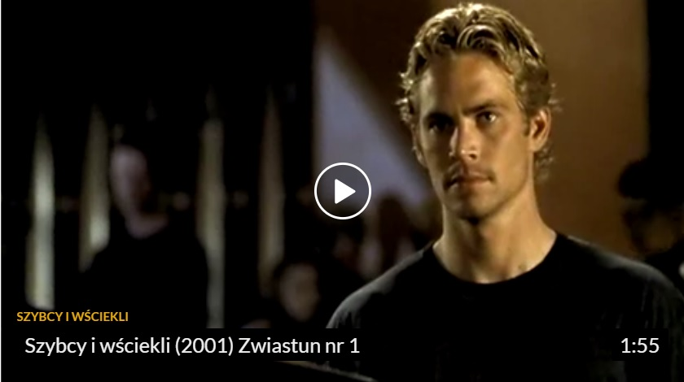

## Fabuła

*Szybcy i wściekli* - amerykański film fabularny (sensacyjny) o zmaganiach samochodowych gangów oparty na artykule Kena Li. Szefem jednego z gangów jest Dominic Toretto (Vin Diesel), który swoje miasto uważa za jeden wielki tor wyścigowy. Drugim wątkiem filmu jest historia młodego policjanta Briana (Paul Walker), mającego wejść do gangu Dominica i odkryć, kto okrada ciężarówki.

## Okładka płyty DVD

{ height=80% width=80%}

## Główne informacje nt. filmu

* **Reżyseria** - *Rob* *Cohen*

* **Scenariusz** - *Gary* *Scott* *Thompson*

* **Gatunek** - *Akcja*

* **Produkcja** - *Niemcy*/*USA*
* **Premiera** - *18* *czerwca* *2001*(*świat*)
* **Nagrody** - *Złoty* *popcorn* *oraz* *11* *nominacji*

## Recenzja filmu

Szybkie, piękne samochody, jeszcze piękniejsze kobiety i mężczyźni jak z żurnala - to bohaterowie filmu "Szybcy i wściekli". Wszystko okraszone emocjami wyścigów i działalności na pograniczu prawa lub raczej daleko poza nim.

Ci wspaniali twardziele to przede wszystkim Dominic - niepokonany bohater wyścigów, przeprowadzanych nielegalnie pod osłoną nocy, jego buntowniczy kumple i piękny blondasek Brian, który usiłuje wślizgnąć się do tego zamkniętego grona. Otaczają ich wspaniałe kobiety: Letty -'ostra' dziewczyna Dominica i Mia, siostra tegoż, której wspomniany blond-heros głęboko zapada w serce. Po wielu podejściach Brianowi udaje się podbić także Dominica, którego ratuje przed aresztowaniem i zadziwia swoją umiejętnością zabawy za kierownicą.

Wszystkich łączą samochodowe pościgi - prawdziwy teatr ulicy, urastający do rangi rytualnych zgromadzeń, przyciągających tłumy entuzjastów.

## Zwiastun

{ height=100% width=100%}

https://fwcdn.pl/video/30588/fstfurious_trlr2_t1.360p.mp4#t=0,5

## Obsada filmu (główni bohaterowie)

{ height=100% width=100%}

## Ciekawostki (błędy w filmie)

1. Podczas końcowej sceny, w której Diesel się ściga z Walkerem, kaskader zastępujący Vin Diesela ma na głowie kask. W tym samym ujęciu, samochód prowadzony przez Paula Walkera ma widoczne stalowe wzmocnienia, których nie było na żadnym z wcześniejszych ujęć.
2. W scenie, gdy po raz ostatni porwana zostaje ciężarówka, Hondą Civic, która się rozbija, jedzie dziewczyna Dominica. Przed uderzeniem auta, widać, że nie ma w nim klatki bezpieczeństwa, która pojawia się chwilę później.
3. Na imprezie, gdy w jednym ujęciu Brian ociera szyjkę butelki z piwem, widać, że w kolejnym powtarza tą czynność.
4. Gdy ścigają się dwa motocykle i Supra, widzimy, że jeden z motocyklistów w ręku ma broń. Chwilę później mężczyzna rozbijając się trzyma obie ręce na kierownicy, a broń gdzieś znika.
5. W końcowej scenie, gdy widzimy trzy Hondy Civic, spojler na samochodzie Dominica jest całkowicie inny niż na początku.

## Dodatkowe informacje

| Boxoffice       |         $207 283 925 na świecie         | data produkcji      |                     2001 |
| --------------- | :-------------------------------------: | ------------------- | -----------------------: |
| **budżet**      |               $38 000 000               | **tytuł** **oryg**. | The Fast and the Furious |
| **dystrybucja** | United International Pictures Sp z o.o. | na podstawie        |         Ken Li "Racer X" |
| **studio**      |           Universal Pictures            | **Ranking**         |                     #445 |

## Inne filmy serii Szybkich i wściekłych

| **Za szybcy za wściekli** 2003 | **szybcy i wściekli tokio drift** 2006 |   **szybko i wściekle** 2009   | **szybcy i wściekli 5** 2011 |
| :----------------------------: | :------------------------------------: | :----------------------------: | ---------------------------- |
|  **szybcy i wściekli 6** 2013  |   **szybcy i wściekli 7**       2015   | **szybcy i wściekli 8**   2017 | **szybcy i wściekli 9** 2021 |

## Soundtrack

1.  Faith Evans feat. Ja Rule – Good Life Remix
2.  Caddillac Tah – Pov City Anthem
3.  Ashanti – When A Man Does Wrong
4.  Tank feat. Ja Rule – Race Against Time Part 2
5.  Ja Rule – Furious
6.  R. Kelly – Take My Time Tonight
7. . Scarface – Suicide
8.  Black Child – The Prayer
9.  Funkmaster Flex feat. Noreaga – Tudunn Tudunn Tudunn (Make U Jump)
10.  Fat Joe – Hustlin
11.  Boo and Gotti – Freestyle